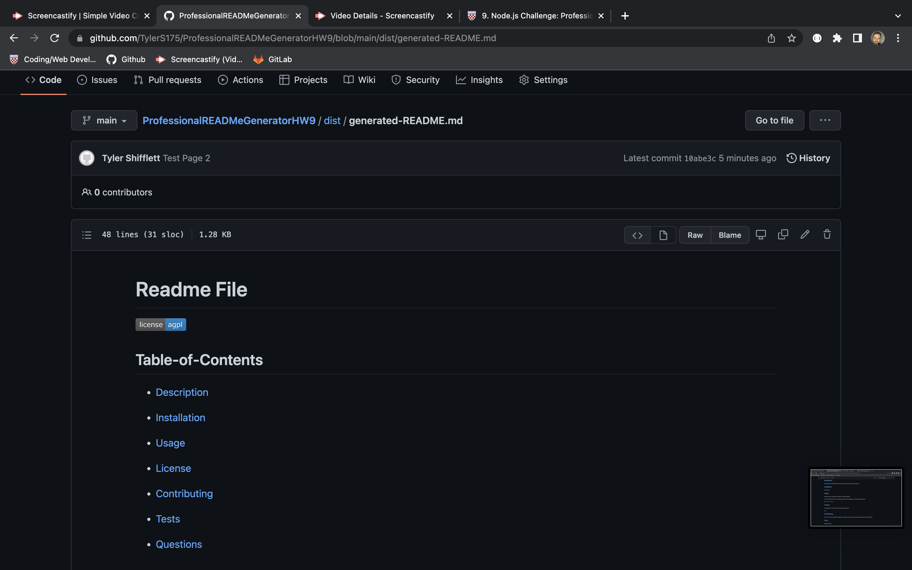
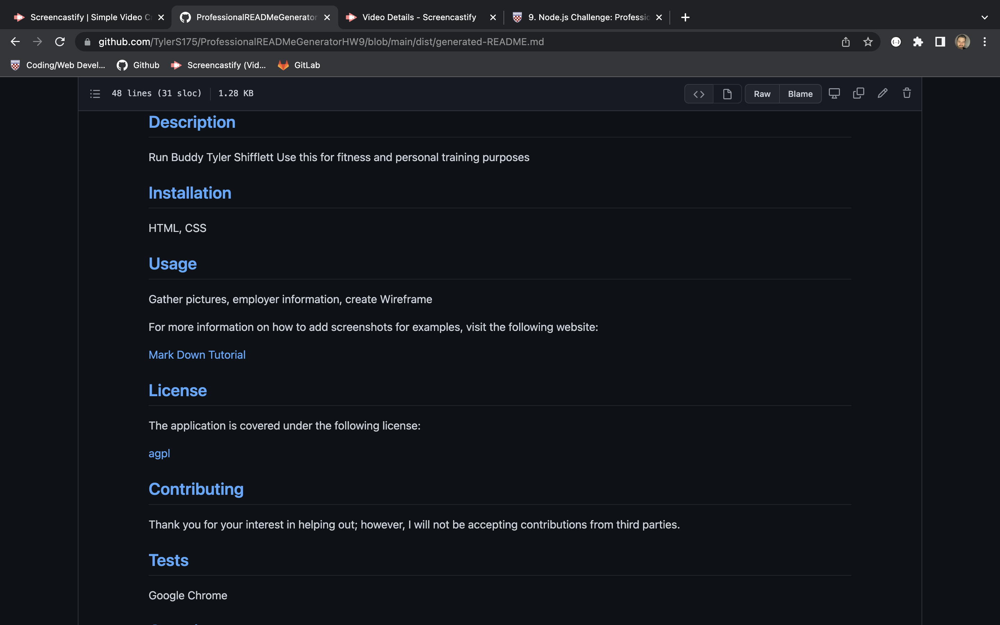

# Professional README Generator Starter Code

[How to create a Professional README](https://coding-boot-camp.github.io/full-stack/github/professional-readme-guide)

Searching for a READme generator that can demostrate your past or current projects. Then you have come to the right place!

Using the Node index.js in the terminal box you will answer a series of questions. This will include your name, Github info, and past projects. 

See screenshot of an example for ReadMe File: 

